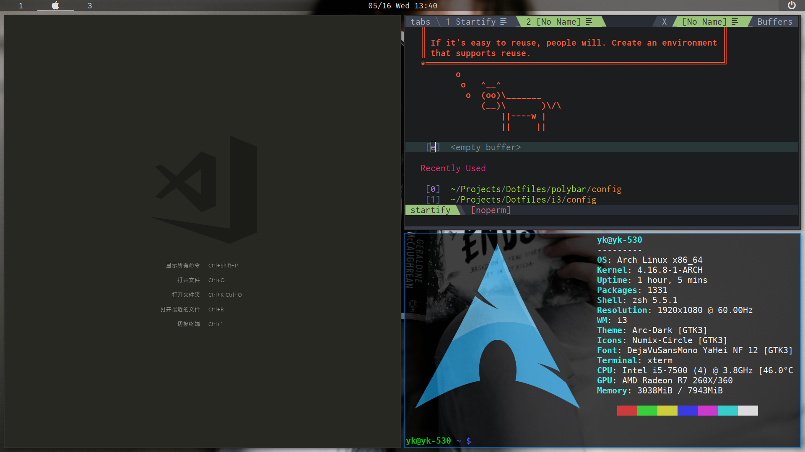

# *yk's Dotfiles*

> Personal Config files and Scripts. Wallpaper credits: [Unsplash](https://unsplash.com)




## Setup
  - OS: `Arch Linux`
  - Windows Manager: [`i3-gaps`](i3/config)
  - Status Bar: [`polybar`](polybar/config)
  - Shell: [`zsh`](.zshrc)
  - Terminal Emulator: [`uxterm`](.Xresources)
  - Text Editor: [`gvim`](.vimrc) \ [`visual-studio-code`](https://gist.github.com/m8524769/824dd8cce44f7146afdc9261196f7546)
  - Application Launcher: [`rofi`](rofi/config.rasi)
  - System Monitor: [`conky`](.conkyrc)
  - File Manager: [`ranger`](ranger/rc.conf)
  - Screen Locker: [`i3lock-color`](i3/i3lock.sh)
  - Notification Daemon: [`dunst`](dunst/dunstrc)
  - Audio Visualizer: [`cava`](cava/config)

## Others
  - [`.xinitrc`](.xinitrc)
  - [`fonts.conf`](fontconfig/fonts.conf)
  - [`makepkg.conf`](pacman/makepkg.conf)
  - [`mirrorlist`](others/mirrorlist)
  - GVim Colorscheme: [`molokai2.vim`](others/molokai2.vim)
  - Highlight Enhancement for Python in Vim: [`python.vim`](others/python.vim)

## Setup for CentOS Server
```shell
sh -c "$(curl -fsSL https://raw.githubusercontent.com/m8524769/Dotfiles/master/setup_centos.sh)"
```
